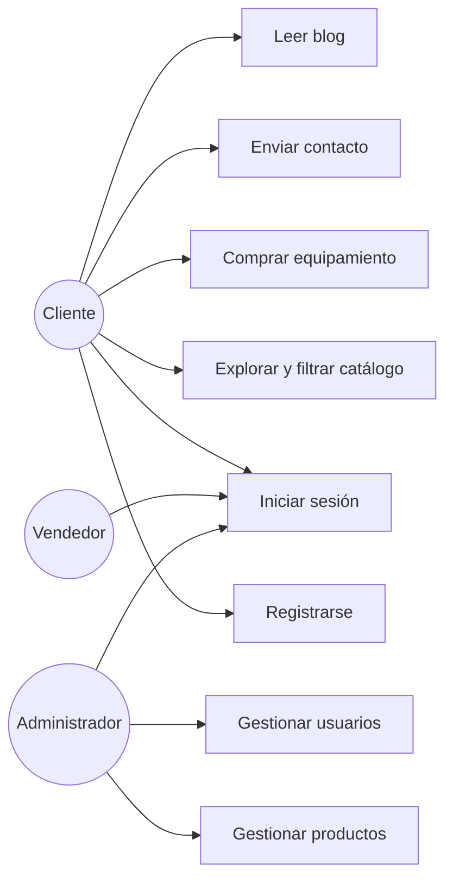
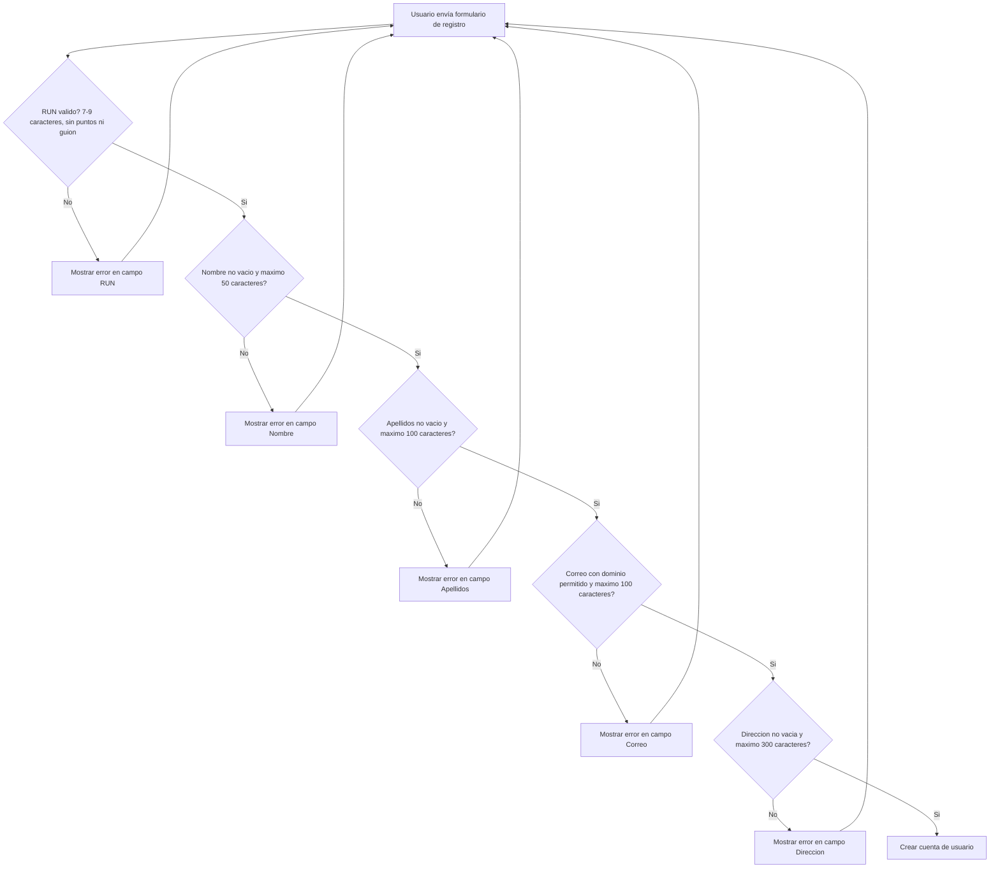

# Tienda Online "Voy y Vuelvo" — Equipamiento de Trekking

> Proyecto frontend (HTML, CSS, JavaScript) — Evaluación Parcial 1 (30%), DSY1104, Duoc UC.
> Trabajo en equipo (3 integrantes).
> Documento ERS versión 1
## Índice

0. [Ficha del documento](#0-ficha-del-documento)
1. [Introducción](#1-introducción)
   - [1.1 Propósito](#11-propósito)
   - [1.2 Ámbito del sistema](#12-ámbito-del-sistema)
   - [1.3 Definiciones, acrónimos y abreviaturas](#13-definiciones-acrónimos-y-abreviaturas)
   - [1.4 Referencias](#14-referencias)
   - [1.5 Visión general del documento](#15-visión-general-del-documento)
2. [Descripción general](#2-descripción-general)
   - [2.1 Perspectiva del producto](#21-perspectiva-del-producto)
   - [2.2 Funciones del producto](#22-funciones-del-producto)
   - [2.3 Características de los usuarios](#23-características-de-los-usuarios)
   - [2.4 Restricciones](#24-restricciones)
   - [2.5 Suposiciones y dependencias](#25-suposiciones-y-dependencias)
   - [2.6 Requisitos futuros](#26-requisitos-futuros)
3. [Requisitos específicos](#3-requisitos-específicos)
   - [3.1 Requisitos comunes de las interfaces](#31-requisitos-comunes-de-las-interfaces)
   - [3.2 Requisitos funcionales](#32-requisitos-funcionales)
   - [3.3 Requisitos no funcionales](#33-requisitos-no-funcionales)
   - [3.4 Otros requisitos](#34-otros-requisitos)
4. [Tecnologías utilizadas](#4-tecnologías-utilizadas)
5. [Planilla de requerimientos](#5-planilla-de-requerimientos)
6. [Casos de uso](#6-casos-de-uso)
7. [Historias de usuario](#7-historias-de-usuario)
8. [Plan de pruebas](#8-plan-de-pruebas)
9. [Manual de usuario](#9-manual-de-usuario)
10. [Diagrama de flujo de validación](#10-diagrama-de-flujo-de-validación)
11. [Mapa de navegación](#11-mapa-de-navegación)
12. [Roles y permisos](#12-roles-y-permisos)
13. [Reglas de validación de formularios](#13-reglas-de-validación-de-formularios)
14. [Guía de estilo](#14-guía-de-estilo)
15. [Estructura de carpetas del proyecto](#15-estructura-de-carpetas-del-proyecto)
16. [Convención de Git y commits](#16-convención-de-git-y-commits)
17. [Reparto de tareas del equipo](#17-reparto-de-tareas-del-equipo)
18. [Cómo ejecutar el proyecto](#18-cómo-ejecutar-el-proyecto)
19. [Matriz de trazabilidad](#19-matriz-de-trazabilidad)

---

## 0. Ficha del documento

| Campo | Información |
|---|---|
| Proyecto | Tienda Online "Voy y Vuelvo" — Equipamiento de Trekking |
| Documento | Especificación de Requisitos de Software (ERS) |
| Curso | DSY1104 — Evaluación Parcial 1 |
| Revisión | 1.0 — Versión parcial |
| Fecha | 15-09-2026 |
| Autores | Michel Sanhueza, Magdalena Marquez, Franco Araya |
| Estado | En elaboración   |

## 1. Introducción

### 1.1 Propósito

Este documento especifica los requisitos funcionales y no funcionales de la tienda online **"Voy y Vuelvo"**, proyecto frontend desarrollado con HTML, CSS y JavaScript para la Evaluación Parcial 1 de DSY1104.

El ERS está dirigido a los integrantes del equipo de desarrollo, docentes/evaluadores y personas que participen en la revisión del proyecto. Su finalidad es establecer qué debe hacer el sistema, qué restricciones posee y cómo verificar que las funcionalidades implementadas cumplen con lo definido.

### 1.2 Ámbito del sistema

**Voy y Vuelvo** es una tienda online de **equipamiento para rutas de trekking** (mochilas, carpas, bastones, calzado técnico, etc.). Cada producto se categoriza según el **nivel de dificultad de ruta** para el que se recomienda (Fácil, Media, Alta).

El proyecto consta de **dos partes**:

- **Tienda (pública):** permite navegar por el catálogo, registrarse, iniciar sesión, revisar productos, administrar el carrito, consultar el blog y contactar a la tienda.
- **Administrador (protegido):** permite gestionar el catálogo y los usuarios del sistema según el rol autenticado.

El sistema **sí** permitirá:

- Explorar y comprar equipamiento de trekking, filtrado por nivel de dificultad de ruta.
- Gestionar un carrito de compras persistente (`localStorage`), con cupón de descuento.
- Registrar e iniciar sesión como cliente.
- Leer artículos del blog y contactar a la tienda.
- Administrar, mediante el rol Administrador, el catálogo de productos y los usuarios del sistema.

El sistema **no** contempla en esta primera entrega:

- Pasarela de pago real; el botón **Pagar** no procesa transacciones.
- Persistencia en base de datos ni backend; los datos se simulan mediante JavaScript y `localStorage`.
- Reserva de rutas como transacción propia; las rutas se presentan como contenido editorial del blog.

### 1.3 Definiciones, acrónimos y abreviaturas

| Término | Definición |
|---|---|
| ERS | Especificación de Requisitos de Software |
| RF | Requisito Funcional |
| RNF | Requisito No Funcional |
| RUN | Rol Único Nacional (identificación chilena) |
| Dificultad | Nivel de exigencia física de una ruta de trekking: Fácil, Media o Alta |
| Cliente | Usuario que navega por la tienda y puede registrarse y comprar |
| Vendedor | Usuario interno con acceso de consulta a productos y órdenes |
| Administrador | Usuario interno con permisos para gestionar productos y usuarios |

### 1.4 Referencias

| Referencia | Uso dentro de este documento |
|---|---|
| Anexo 1 — Instrucciones para el desarrollo de la Evaluación 1 | Base para el alcance y las condiciones de la entrega frontend |
| Anexo 4 — ERS, Especificación de Requisitos del Software | Estructura y contenido de requisitos según IEEE 830 |
| Prototipo visual "Voy & Vuelvo" | Referencia para paleta, tipografía, tarjetas, botones, navegación e indicador de pasos |
| Repositorio remoto GitHub del proyecto | Control de versiones, historial de cambios y colaboración del equipo |
### 1.5 Visión general del documento

El documento se organiza de acuerdo con la estructura del ERS solicitada. Primero se presentan el propósito, alcance y contexto general del sistema. Luego se describen las interfaces, los requisitos funcionales y no funcionales y otros requisitos. Posteriormente se incluyen la planilla de requerimientos, casos de uso, historias de usuario, plan de pruebas, manual de usuario, diagramas, reglas de validación, guía de estilo, estructura técnica y trazabilidad.

---

## 2. Descripción general

### 2.1 Perspectiva del producto

**Voy y Vuelvo** es un producto frontend independiente para esta entrega. No se integra con un backend ni con una base de datos; la lógica de interacción se ejecuta en el navegador mediante JavaScript y la persistencia disponible en esta versión se realiza con `localStorage`.

La relación con productos y servicios externos se limita a componentes de apoyo del entorno web, principalmente:

- **Navegador web:** ejecuta HTML, CSS y JavaScript.
- **Google Fonts:** proporciona las tipografías externas cargadas mediante `<link>`.
- **Web Storage API (`localStorage`):** conserva información del carrito en el navegador.
- **Visual Studio Code + Live Server:** herramientas utilizadas durante el desarrollo y ejecución local.

No existe en esta entrega un sistema externo que procese pagos, almacene datos en un servidor o exponga una API de negocio.

### 2.2 Funciones del producto

Las funciones principales del producto se agrupan en los siguientes bloques:

| Área | Funciones principales |
|---|---|
| Cuenta de usuario | Registro, validación de datos e inicio de sesión |
| Catálogo | Listado, filtrado por dificultad y detalle de productos |
| Carrito | Agregar productos, modificar cantidades, eliminar, persistir y aplicar cupón |
| Contenido | Información de la empresa, blog y detalle de artículos |
| Contacto | Envío de mensajes mediante formulario validado |
| Administración | Gestión de productos y usuarios según el rol Administrador |
| Control de acceso | Visualización de funciones según Cliente, Vendedor o Administrador |

### 2.3 Características de los usuarios

| Perfil | Descripción | Conocimientos requeridos |
|---|---|---|
| Cliente | Visitante que navega, se registra, compra equipamiento y se contacta | Uso básico de navegador web |
| Vendedor | Usuario interno que consulta productos y órdenes | Uso básico de PC |
| Administrador | Usuario interno con acceso al panel de gestión | Uso de PC a nivel medio |

### 2.4 Restricciones

- Debe implementarse solo con **HTML, CSS y JavaScript**, sin frameworks ni backend para esta entrega.
- Se utiliza una hoja de estilos CSS externa y propia para la tienda y otra para el panel administrador.
- Las validaciones de formularios se realizan con **JavaScript puro** y deben entregar mensajes de error específicos.
- Los correos válidos en los formularios deben pertenecer a los dominios `@duoc.cl`, `@profesor.duoc.cl` o `@gmail.com`.
- El carrito debe persistir mediante `localStorage` del navegador.
- El diseño debe ser responsivo y consistente en las páginas definidas para la entrega.
- La solución depende de la ejecución en un navegador compatible con las tecnologías web utilizadas.

### 2.5 Suposiciones y dependencias

- Se asume que el catálogo de productos y los usuarios se simulan mediante arreglos JavaScript durante esta entrega.
- Se asume que no existe una base de datos ni un backend asociado al proyecto en esta versión.
- Las regiones y comunas se cargan desde un arreglo JS complementario.
- La persistencia del carrito depende de que el navegador permita el uso de `localStorage`.
- Las tipografías declaradas como externas dependen de su disponibilidad para ser cargadas desde Google Fonts.
- La ejecución local puede realizarse directamente abriendo `index.html` o utilizando Live Server.

### 2.6 Requisitos futuros

- Integración con un backend real (API REST) para persistir productos, usuarios y órdenes.
- Incorporar una vista de **Rutas** como catálogo reservable, además del equipamiento.
- Integrar una pasarela de pago real.

---

## 3. Requisitos específicos

Esta sección contiene el detalle de los requisitos que debe satisfacer la solución. Cada requisito posee un identificador único y puede ser relacionado con casos de uso, historias de usuario y pruebas.

### 3.1 Requisitos comunes de las interfaces

#### 3.1.1 Interfaces de usuario

Las interfaces del sistema serán páginas web organizadas en dos áreas: tienda pública y panel administrador.

**Tienda pública:**

- Página principal (`index.html`).
- Catálogo y detalle de productos.
- Carrito de compras.
- Registro e inicio de sesión.
- Página "Nosotros".
- Blog y detalle de artículos.
- Formulario de contacto.

**Panel administrador:**

- Inicio del panel.
- Listado, creación y edición de productos.
- Listado, creación y edición de usuarios.

Los componentes de interfaz deben mantener navegación consistente, diseño responsivo, botones de acción claros y formularios con mensajes de validación específicos. La guía visual se detalla en la sección 13.

#### 3.1.2 Interfaces de hardware

Para esta entrega **no se define una interfaz con hardware especializado**. El sistema se ejecuta como aplicación web y utiliza los dispositivos de entrada y salida disponibles en el equipo desde el que se abre el navegador.

La solución debe considerar interacción mediante dispositivos de escritorio y pantallas táctiles compatibles con el navegador, sin requerir periféricos adicionales.

#### 3.1.3 Interfaces de software

| Software / componente | Propósito de la interfaz | Definición / formato |
|---|---|---|
| Navegador web | Ejecutar la tienda y el panel | HTML5, CSS3 y JavaScript |
| Web Storage API | Persistir el contenido del carrito | `localStorage`, datos almacenados en el navegador |
| Google Fonts | Cargar tipografías de interfaz | `<link>` en el `<head>` de las páginas |
| Visual Studio Code / Live Server | Desarrollo y ejecución local | Archivos estáticos del proyecto |

No se define en esta entrega una interfaz con una API de negocio, una base de datos o una pasarela de pago.

#### 3.1.4 Interfaces de comunicación

La solución es una aplicación frontend sin backend para esta entrega. Por lo tanto, **no requiere protocolos de comunicación de negocio entre cliente y servidor**.

Las dependencias externas declaradas corresponden a la carga de recursos web, como las tipografías externas. Las funcionalidades del catálogo, validaciones y carrito se ejecutan localmente en el navegador.

### 3.2 Requisitos funcionales

Los requisitos funcionales describen las acciones que el sistema debe realizar, sus entradas, respuestas y condiciones de validación.

| ID | Requisito | Actor | Entrada principal | Respuesta / salida | Verificación |
|---|---|---|---|---|---|
| R.1 | Autenticar usuario al iniciar sesión | Cliente, Vendedor, Administrador | Correo y contraseña | Usuario autenticado y acceso según rol | CP-05 + CP-22 |
| R.2 | Registrar nuevo usuario | Cliente | RUN, nombre, apellidos, correo, contraseña, región, comuna y dirección | Cuenta creada o mensaje de error | CP-06 a CP-11 |
| R.3 | Listar equipamiento disponible | Cliente | Acceso a Productos | Listado con imagen, nombre y precio | Inspección funcional |
| R.4 | Filtrar equipamiento por dificultad | Cliente | Categoría Fácil, Media o Alta | Listado filtrado | Inspección funcional |
| R.5 | Ver detalle de producto | Cliente | Selección de producto | Ficha con imagen, descripción, precio y stock | Inspección funcional |
| R.6 | Añadir producto al carrito | Cliente | Producto y cantidad | Producto agregado al carrito | Inspección funcional + CP-19 |
| R.7 | Gestionar carrito | Cliente | Cambios de cantidad / eliminación | Subtotales y total actualizados | Inspección funcional |
| R.9 | Aplicar cupón de descuento | Cliente | Código de cupón | Total recalculado cuando el cupón es válido | Inspección funcional |
| R.10 | Enviar mensaje de contacto | Cliente | Nombre, correo y comentario | Mensaje enviado si los datos son válidos | CP-12 a CP-14 |
| R.11 | Mostrar información de empresa | Cliente | Acceso a Nosotros | Información de tienda y equipo | Inspección funcional |
| R.12 | Listar artículos del blog | Cliente | Acceso a Blogs | Listado con imagen, título y descripción corta | Inspección funcional |
| R.13 | Ver detalle de artículo | Cliente | Selección de artículo | Contenido completo del artículo | Inspección funcional |
| R.15 | Validar formulario de inicio de sesión | Cliente, Vendedor, Administrador | Correo y contraseña | Errores específicos o validación exitosa | CP-01 a CP-05 |
| R.16 | Validar formulario de registro | Cliente, Administrador | Datos de registro | Errores específicos o registro permitido | CP-06 a CP-11 |
| R.17 | Validar formulario de contacto | Cliente | Datos de contacto | Errores específicos o envío permitido | CP-12 a CP-14 |
| R.18 | Gestionar catálogo de productos | Administrador | Datos de producto | Producto creado, editado o listado | CP-15 a CP-18 |
| R.19 | Validar formulario de producto | Administrador | Código, nombre, precio y stock | Errores específicos o producto válido | CP-15 a CP-18 |
| R.20 | Gestionar usuarios del sistema | Administrador | Datos de usuario y perfil | Usuario creado, editado o listado | Inspección funcional |

> **Nota:** R.8, R.14, R.21, R.22 y R.23 son requisitos no funcionales y se detallan en la sección 3.3.

### 3.3 Requisitos no funcionales

Los requisitos no funcionales establecen características de calidad, seguridad, operación y mantenimiento que complementan las funcionalidades del sistema.

#### 3.3.1 Requisitos de rendimiento

| ID | Requisito | Criterio verificable |
|---|---|---|
| RNF-01 | Las validaciones de formularios deben ejecutarse antes de enviar los datos inválidos | El formulario no debe enviarse cuando una regla falla |
| RNF-02 | Las operaciones locales de filtrado, actualización del carrito y validación deben reflejar su resultado sin requerir recarga de la página | En una ejecución normal del proyecto, el resultado debe visualizarse en un máximo de **1 segundo** desde la acción del usuario |
| RNF-03 | La solución no debe requerir instalación de dependencias o proceso de compilación para ejecutarse | El proyecto debe poder abrirse mediante `index.html` o Live Server |

> Estos criterios corresponden al carácter 100% frontend de esta entrega; no se establecen métricas de transacciones por segundo porque no existe backend ni procesamiento remoto de negocio en esta versión.

#### 3.3.2 Seguridad

| ID | Requisito | Criterio verificable |
|---|---|---|
| RNF-04 | Las funciones restringidas deben depender de autenticación | Un usuario no autenticado no debe acceder al panel protegido |
| RNF-05 | El acceso debe estar restringido por rol | Cliente, Vendedor y Administrador deben visualizar únicamente las funciones correspondientes a su perfil |
| RNF-06 | Los formularios deben validar los datos de entrada | Los datos que incumplen las reglas definidas deben bloquear el envío |
| RNF-07 | Esta entrega no debe simular una pasarela de pago real ni almacenar datos de pago | El botón Pagar no debe procesar transacciones reales |

> Debido a que esta versión no posee backend ni base de datos, el control de acceso es una lógica de frontend propia de la entrega y no sustituye una implementación de seguridad de servidor.

#### 3.3.3 Fiabilidad

| ID | Requisito | Criterio verificable |
|---|---|---|
| RNF-08 | El sistema debe evitar registrar formularios que contengan datos inválidos | La operación se bloquea y se muestra el error correspondiente |
| RNF-09 | El carrito debe conservar sus datos mediante `localStorage` | Al recargar la página, los productos previamente agregados deben permanecer |

#### 3.3.4 Disponibilidad

| ID | Requisito | Criterio verificable |
|---|---|---|
| RNF-10 | El frontend debe estar disponible siempre que los archivos del proyecto sean accesibles y se utilice un navegador compatible | La aplicación debe poder iniciar desde `index.html` o Live Server sin requerir backend |

> En esta entrega no se establece un porcentaje de disponibilidad de servidor, porque no existe un servidor de aplicación propio.

#### 3.3.5 Mantenibilidad

| ID | Requisito | Criterio verificable |
|---|---|---|
| RNF-11 | El CSS debe estar separado del HTML | La tienda utiliza `css/styles.css` y el panel utiliza `css/admin.css` |
| RNF-12 | La lógica JavaScript debe estar separada por responsabilidad | Los archivos de validación, carrito, datos de productos y regiones/comunas se mantienen separados |
| RNF-13 | El proyecto debe mantener control de versiones | El repositorio debe conservar historial de commits claros y coherentes |

#### 3.3.6 Portabilidad

| ID | Requisito | Criterio verificable |
|---|---|---|
| RNF-14 | El proyecto debe utilizar tecnologías web estándar | La solución se implementa con HTML5, CSS3 y JavaScript ES6+ sin framework obligatorio |
| RNF-15 | La interfaz debe adaptarse a distintos tamaños de pantalla | El diseño debe utilizar Flexbox/Grid y media queries para las vistas definidas |
| RNF-16 | La aplicación debe poder ejecutarse localmente sin build tools | Debe funcionar abriendo `index.html` o mediante Live Server |

### 3.4 Otros requisitos

| ID | Requisito |
|---|---|
| OR-01 | El proyecto debe ser entregado como frontend basado en HTML, CSS y JavaScript para la Evaluación 1. |
| OR-02 | El proyecto debe contar con un repositorio remoto GitHub para el control de versiones y colaboración del equipo. |
| OR-03 | La documentación debe mantener relación entre requisitos, casos de uso, historias de usuario y pruebas. |
| OR-04 | Las funcionalidades de rutas en esta entrega se presentan como contenido del blog y no como transacciones de reserva. |
| OR-05 | La solución debe respetar la guía visual definida para la marca "Voy & Vuelvo". |

---

## 4. Tecnologías utilizadas

| Categoría | Tecnología | Uso en el proyecto |
|---|---|---|
| Marcado | HTML5 | Estructura semántica de todas las páginas |
| Estilos | CSS3 (Flexbox, Grid, Media Queries) | Hoja de estilos externa y diseño responsivo |
| Lógica / interactividad | JavaScript (ES6+, vanilla) | Validaciones de formularios, carrito y filtrado de productos |
| Almacenamiento en cliente | Web Storage API (`localStorage`) | Persistencia del carrito de compras entre sesiones del navegador |
| Tipografía | Google Fonts | Carga de tipografías declaradas en la guía de estilo |
| Control de versiones | Git + GitHub | Repositorio remoto colaborativo del equipo |
| Entorno de desarrollo | Visual Studio Code + extensión Live Server | Edición y ejecución local durante el desarrollo |

## 5. Planilla de requerimientos

| N° | Nombre | Tipo | Clasificación | Prioridad | Actores | Descripción | Estado |
|---|---|---|---|---|---|---|---|
| R.1 | Autenticar usuario al iniciar sesión | Funcional | Funcional de sistema | Esencial | Cliente, Vendedor, Administrador | Autenticar mediante correo y contraseña antes de funciones restringidas. | Aprobado |
| R.2 | Registrar nuevo usuario | Funcional | Funcional de usuario | Esencial | Cliente | Crear cuenta con RUN, nombre, apellidos, correo, contraseña, región, comuna y dirección. | Aprobado |
| R.3 | Listar equipamiento de trekking disponible | Funcional | Funcional de usuario | Esencial | Cliente | Mostrar catálogo con imagen, nombre y precio. | Aprobado |
| R.4 | Filtrar equipamiento por nivel de dificultad de ruta | Funcional | Funcional de usuario | Esencial | Cliente | Filtrar por Fácil, Media o Alta. | Aprobado |
| R.5 | Ver detalle de un producto de equipamiento | Funcional | Funcional de usuario | Esencial | Cliente | Mostrar imagen, descripción, precio y stock. | Aprobado |
| R.6 | Añadir producto al carrito de compras | Funcional | Funcional de usuario | Esencial | Cliente | Añadir producto indicando cantidad. | Aprobado |
| R.7 | Gestionar el carrito de compras | Funcional | Funcional de usuario | Esencial | Cliente | Visualizar, modificar y eliminar productos y actualizar total. | Aprobado |
| R.8 | Persistir el carrito de compras | No Funcional | No funcional de producto | Esencial | Cliente | Conservar el carrito mediante `localStorage`. | Aprobado |
| R.9 | Aplicar cupón de descuento | Funcional | Funcional de usuario | Condicional | Cliente | Aplicar cupón válido y recalcular el total. | Aprobado |
| R.10 | Enviar mensaje de contacto | Funcional | Funcional de usuario | Esencial | Cliente | Enviar mensaje con nombre, correo y comentario. | Aprobado |
| R.11 | Mostrar información de la empresa | Funcional | Funcional de usuario | Complementario | Cliente | Mostrar información de tienda y equipo. | Aprobado |
| R.12 | Listar artículos del blog de trekking | Funcional | Funcional de usuario | Complementario | Cliente | Mostrar listado de artículos con imagen, título y descripción. | Aprobado |
| R.13 | Ver detalle de un artículo del blog | Funcional | Funcional de usuario | Complementario | Cliente | Mostrar detalle completo de un artículo. | Aprobado |
| R.14 | Navegar mediante menú consistente | No Funcional | No funcional de producto | Esencial | Cliente, Vendedor, Administrador | Mantener navegación visible y consistente. | Aprobado |
| R.15 | Validar formulario de inicio de sesión | Funcional | Funcional de sistema | Esencial | Cliente, Vendedor, Administrador | Validar correo y contraseña con reglas definidas. | Aprobado |
| R.16 | Validar formulario de registro de usuario | Funcional | Funcional de sistema | Esencial | Cliente, Administrador | Validar RUN, nombre, apellidos, correo y dirección. | Aprobado |
| R.17 | Validar formulario de contacto | Funcional | Funcional de sistema | Esencial | Cliente | Validar nombre, correo y comentario. | Aprobado |
| R.18 | Gestionar catálogo de productos (administrador) | Funcional | Funcional de usuario | Esencial | Administrador | Crear, editar y listar productos. | Aprobado |
| R.19 | Validar formulario de producto | Funcional | Funcional de sistema | Esencial | Administrador | Validar código, nombre, precio y stock. | Aprobado |
| R.20 | Gestionar usuarios del sistema (administrador) | Funcional | Funcional de usuario | Esencial | Administrador | Crear, editar y listar usuarios y su perfil. | Aprobado |
| R.21 | Restringir accesos según rol | No Funcional | No funcional de producto (seguridad) | Esencial | Cliente, Vendedor, Administrador | Mostrar únicamente funciones permitidas para el rol autenticado. | Aprobado |
| R.22 | Aplicar diseño responsivo y consistente | No Funcional | No funcional de producto | Esencial | Cliente, Vendedor, Administrador | Adaptar las vistas a distintos tamaños de pantalla. | Aprobado |
| R.23 | Mantener repositorio de control de versiones | No Funcional | No funcional de la Organización | Esencial | Equipo de desarrollo | Mantener repositorio remoto, commits claros y aporte de los integrantes. | Aprobado |


---

## 6. Casos de uso



**UC-01 · Registrar usuario**
- **Actor:** Cliente
- **Precondición:** El visitante no tiene cuenta.
- **Flujo principal:** (1) Accede a "Registro de usuario". (2) Completa RUN, nombre, apellidos, correo, contraseña, región/comuna y dirección. (3) El sistema valida los campos en tiempo real. (4) Envía el formulario. (5) El sistema crea la cuenta.
- **Flujo alternativo:** Si algún campo es inválido, se muestra un mensaje de error específico y no se envía el formulario.
- **Referencia:** R.2, R.16

**UC-02 · Iniciar sesión**
- **Actor:** Cliente, Vendedor, Administrador
- **Precondición:** El usuario ya tiene una cuenta registrada.
- **Flujo principal:** (1) Ingresa correo y contraseña. (2) El sistema valida el formato. (3) El sistema autentica y redirige según el rol.
- **Flujo alternativo:** Credenciales inválidas o mal formateadas → se muestra mensaje de error y no se autentica.
- **Referencia:** R.1, R.15

**UC-03 · Explorar y filtrar el catálogo de equipamiento**
- **Actor:** Cliente
- **Precondición:** Ninguna (acceso público).
- **Flujo principal:** (1) Accede a "Productos". (2) Visualiza el listado con imagen, nombre y precio. (3) Filtra por categoría/dificultad. (4) Selecciona un producto para ver su detalle.
- **Referencia:** R.3, R.4, R.5

**UC-04 · Comprar equipamiento**
- **Actor:** Cliente
- **Precondición:** Existe al menos un producto con stock disponible.
- **Flujo principal:** (1) Añade uno o más productos al carrito indicando cantidad. (2) Revisa el carrito. (3) Ingresa un cupón de descuento (opcional). (4) Presiona "Pagar".
- **Flujo alternativo:** El carrito persiste en `localStorage` aunque el cliente cierre el navegador y vuelva más tarde.
- **Referencia:** R.6, R.7, R.8, R.9

**UC-05 · Enviar mensaje de contacto**
- **Actor:** Cliente
- **Flujo principal:** (1) Accede a "Contacto". (2) Completa nombre, correo y comentario. (3) El sistema valida en tiempo real. (4) Envía el mensaje.
- **Referencia:** R.10, R.17

**UC-06 · Leer artículos del blog**
- **Actor:** Cliente
- **Flujo principal:** (1) Accede a "Blogs". (2) Visualiza el listado de artículos. (3) Selecciona uno para ver el detalle completo.
- **Referencia:** R.12, R.13

**UC-07 · Gestionar catálogo de productos**
- **Actor:** Administrador
- **Precondición:** Sesión iniciada con rol Administrador.
- **Flujo principal:** (1) Accede al panel administrador. (2) Visualiza el listado de productos. (3) Crea un producto nuevo o edita uno existente. (4) El sistema valida los campos.
- **Referencia:** R.18, R.19

**UC-08 · Gestionar usuarios del sistema**
- **Actor:** Administrador
- **Precondición:** Sesión iniciada con rol Administrador.
- **Flujo principal:** (1) Accede al listado de usuarios. (2) Crea un usuario nuevo o edita uno existente. (3) Asigna su tipo de perfil: Administrador, Vendedor o Cliente.
- **Referencia:** R.20

---

## 7. Historias de usuario

**HU-01 — Registro de usuario**
**Como** visitante **quiero** crear una cuenta con mis datos personales **para** poder iniciar sesión y comprar equipamiento.
- Dado que completo todos los campos válidos, cuando envío el formulario, entonces se crea mi cuenta.
- Dado que mi RUN o correo no cumple el formato exigido, cuando intento enviar, entonces veo un mensaje de error específico y el envío se bloquea.
- *Referencia: R.2, R.16*

**HU-02 — Inicio de sesión**
**Como** usuario registrado **quiero** iniciar sesión con mi correo y contraseña **para** acceder a las funciones según mi rol.
- Dado credenciales válidas, cuando inicio sesión, entonces accedo al sitio según mi perfil.
- Dado un correo con dominio no permitido, cuando intento validar, entonces el sistema indica el error antes de enviar el formulario.
- *Referencia: R.1, R.15*

**HU-03 — Explorar catálogo de equipamiento**
**Como** cliente **quiero** ver todo el equipamiento disponible con imagen, nombre y precio **para** decidir qué comprar.
- Dado que existen productos cargados, cuando visito "Productos", entonces veo el listado completo.
- *Referencia: R.3*

**HU-04 — Filtrar equipamiento por dificultad de ruta**
**Como** cliente **quiero** filtrar el catálogo por nivel de dificultad (Fácil, Media, Alta) **para** encontrar el equipo adecuado a mi ruta.
- Dado que selecciono una categoría, cuando aplico el filtro, entonces solo veo productos de esa dificultad.
- *Referencia: R.4*

**HU-05 — Ver detalle de un producto**
**Como** cliente **quiero** ver la descripción, precio y stock de un producto **para** decidir si lo compro.
- Dado un producto del listado, cuando hago clic en él, entonces veo su ficha completa.
- *Referencia: R.5*

**HU-06 — Añadir productos al carrito**
**Como** cliente **quiero** añadir productos al carrito indicando la cantidad **para** comprarlos más adelante.
- Dado un producto con stock, cuando indico una cantidad y lo añado, entonces aparece reflejado en el carrito.
- *Referencia: R.6, R.8*

**HU-07 — Gestionar el carrito y aplicar cupón**
**Como** cliente **quiero** modificar cantidades, eliminar productos y aplicar un cupón de descuento **para** ajustar mi compra antes de pagar.
- Dado un carrito con productos, cuando cambio una cantidad, entonces el total se recalcula automáticamente.
- Dado un cupón válido, cuando lo aplico, entonces el total se actualiza con el descuento.
- *Referencia: R.7, R.9*

**HU-08 — Contactar a la tienda**
**Como** visitante **quiero** enviar un mensaje con mi consulta **para** recibir ayuda o información adicional.
- Dado que completo nombre, correo y comentario válidos, cuando envío, entonces el mensaje se registra correctamente.
- *Referencia: R.10, R.17*

**HU-09 — Leer artículos del blog**
**Como** cliente **quiero** leer artículos y datos curiosos sobre rutas de trekking **para** informarme antes de mi próxima salida.
- Dado que existen artículos publicados, cuando entro a "Blogs", entonces veo el listado y puedo abrir el detalle de cada uno.
- *Referencia: R.12, R.13*

**HU-10 — (Admin) Gestionar catálogo de productos**
**Como** administrador **quiero** crear y editar productos del catálogo **para** mantener la tienda actualizada.
- Dado que completo los datos obligatorios de un producto, cuando lo guardo, entonces queda disponible en la tienda.
- Dado un precio o stock negativo, cuando intento guardar, entonces el sistema rechaza la operación.
- *Referencia: R.18, R.19*

**HU-11 — (Admin) Gestionar usuarios del sistema**
**Como** administrador **quiero** crear y editar usuarios asignando su tipo de perfil **para** controlar quién accede a cada función del sistema.
- Dado que asigno el tipo "Vendedor" a un usuario, cuando este inicia sesión, entonces solo ve productos y órdenes en modo lectura.
- *Referencia: R.20, R.21*

---

## 8. Plan de pruebas

Casos de prueba manuales para verificar validaciones JavaScript, funcionalidades principales y requisitos no funcionales. "Resultado esperado: Error" significa que la operación debe bloquearse y mostrar un mensaje específico cuando corresponda.

### Formulario de inicio de sesión

| ID | Escenario / dato de entrada | Resultado esperado |
|---|---|---|
| CP-01 | Correo vacío | Error: "El correo es obligatorio" |
| CP-02 | Correo `usuario@hotmail.com` | Error: dominio no válido |
| CP-03 | Correo válido + contraseña `abc` | Error: contraseña entre 4 y 10 caracteres |
| CP-04 | Correo válido + contraseña de 11 caracteres | Error: contraseña excede el máximo |
| CP-05 | Correo `alumno@duoc.cl` + contraseña `1234` | Éxito: inicia sesión |

### Formulario de registro de usuario

| ID | Escenario / dato de entrada | Resultado esperado |
|---|---|---|
| CP-06 | RUN `19.011.022-K` | Error: formato de RUN inválido |
| CP-07 | RUN de 6 caracteres | Error: RUN fuera de rango (7 a 9) |
| CP-08 | Nombre vacío | Error: nombre obligatorio |
| CP-09 | Correo `test@yahoo.com` | Error: dominio no válido |
| CP-10 | Dirección vacía | Error: dirección obligatoria |
| CP-11 | Todos los campos válidos | Éxito: cuenta creada |

### Formulario de contacto

| ID | Escenario / dato de entrada | Resultado esperado |
|---|---|---|
| CP-12 | Nombre de 120 caracteres | Error: excede el máximo de 100 |
| CP-13 | Comentario vacío | Error: comentario obligatorio |
| CP-14 | Nombre, correo y comentario válidos | Éxito: mensaje enviado |

### Formulario de producto (administrador)

| ID | Escenario / dato de entrada | Resultado esperado |
|---|---|---|
| CP-15 | Código de 2 caracteres | Error: mínimo 3 caracteres |
| CP-16 | Precio `-500` | Error: precio no puede ser negativo |
| CP-17 | Stock `10.5` | Error: stock debe ser entero |
| CP-18 | Código, nombre, precio y stock válidos | Éxito: producto guardado |

### Carrito de compras

| ID | Escenario / dato de entrada | Resultado esperado |
|---|---|---|
| CP-19 | Intentar añadir producto con stock 0 | Botón deshabilitado o aviso de sin stock |
| CP-20 | Añadir productos y recargar la página | El carrito conserva los productos mediante `localStorage` |

### Roles, navegación y calidad

| ID | Escenario / dato de entrada | Resultado esperado |
|---|---|---|
| CP-21 | Cliente autenticado intenta entrar al panel administrador | Acceso administrativo bloqueado/no visible |
| CP-22 | Vendedor inicia sesión | Visualiza productos y órdenes en modo lectura, sin otras funciones administrativas |
| CP-23 | Navegar entre páginas públicas | El menú mantiene estructura y opciones consistentes |
| CP-24 | Reducir y ampliar el ancho de la ventana del navegador | El contenido se adapta sin perder las funciones principales |
| CP-25 | Revisar estructura de estilos | La tienda usa CSS externo y el panel usa `admin.css`, sin estilos inline como mecanismo principal |
 

## 9. Manual de usuario

### Como cliente

1. **Ingresar al sitio:** abre `index.html` para ver la página principal con el equipamiento destacado.
2. **Crear una cuenta:** haz clic en "Registrar usuario" en el menú, completa tus datos y envía el formulario.
3. **Iniciar sesión:** haz clic en "Iniciar sesión" e ingresa tu correo y contraseña.
4. **Explorar el catálogo:** entra a "Productos" y usa el filtro de dificultad (Fácil, Media, Alta).
5. **Ver el detalle:** haz clic sobre un producto para consultar descripción, precio y stock.
6. **Añadir al carrito:** indica la cantidad deseada y presiona "Añadir al carrito".
7. **Revisar y pagar:** abre el carrito, ajusta cantidades o elimina productos, aplica un cupón si corresponde y presiona "Pagar". El pago no procesa una transacción real en esta entrega.
8. **Leer el blog:** entra a "Blogs" y selecciona un artículo para leerlo completo.
9. **Contactar a la tienda:** entra a "Contacto", completa el formulario y envíalo.

### Como administrador

1. **Iniciar sesión** con una cuenta de tipo Administrador.
2. **Acceder al panel administrador**, donde verás un menú vertical con las secciones de gestión.
3. **Gestionar productos:** en "Producto", puedes ver, crear o editar productos.
4. **Gestionar usuarios:** en "Usuario", puedes ver, crear o editar usuarios y asignar su tipo de perfil.

> Un usuario con rol **Vendedor** que inicia sesión solo verá el listado y detalle de productos y órdenes, sin acceso a las demás funciones administrativas.

---

## 10. Diagrama de flujo de validación

Ejemplo del flujo de validación en tiempo real para el formulario de **registro de usuario**:



La misma lógica se replica para los formularios de inicio de sesión, contacto y producto, usando las reglas descritas en la sección 12.

---

## 11. Mapa de navegación

### Tienda (pública)

```text
Página principal (Home)
├── Productos ──────────► Detalle de producto ──► Carrito
├── Registro de usuario
├── Iniciar sesión
├── Nosotros
├── Blogs ──────────────► Detalle blog #1
│                    └──► Detalle blog #2
└── Contacto
```

### Administrador (protegido)

```text
Home (admin)
├── Producto
│   ├── Nuevo producto
│   ├── Editar producto
│   └── Mostrar/listado de productos
└── Usuario
    ├── Nuevo usuario
    ├── Editar usuario
    └── Mostrar/listado de usuarios
```

---

## 12. Roles y permisos

| Rol | Acceso |
|---|---|
| **Administrador** | Acceso total al sistema (tienda + panel administrador completo). |
| **Vendedor** | Puede visualizar el listado y detalle de productos, y el listado y detalle de órdenes. Ningún otro acceso administrativo debe estar visible para este rol. |
| **Cliente** | Solo puede acceder a la tienda (parte pública). No tiene acceso al panel administrador. |

---

## 13. Reglas de validación de formularios

### Inicio de sesión

| Campo | Reglas |
|---|---|
| Correo | Requerido · máx. 100 caracteres · solo dominios `@duoc.cl`, `@profesor.duoc.cl`, `@gmail.com` |
| Contraseña | Requerida · entre 4 y 10 caracteres |

### Registro / mantenedor de usuario

| Campo | Reglas |
|---|---|
| RUN | Requerido · sin puntos ni guion (ej. `19011022K`) · entre 7 y 9 caracteres · debe validarse que el RUN sea correcto |
| Nombre | Requerido · máx. 50 caracteres |
| Apellidos | Requerido · máx. 100 caracteres |
| Correo | Requerido · máx. 100 caracteres · solo dominios `@duoc.cl`, `@profesor.duoc.cl`, `@gmail.com` |
| Fecha de nacimiento | Opcional |
| Tipo de usuario | Solo en vista administrador · select: Administrador, Cliente, Vendedor |
| Región / Comuna | Select dependiente; al cambiar la región se actualizan las comunas |
| Dirección | Requerida · máx. 300 caracteres |

### Contacto

| Campo | Reglas |
|---|---|
| Nombre | Requerido · máx. 100 caracteres |
| Correo | Máx. 100 caracteres · solo dominios `@duoc.cl`, `@profesor.duoc.cl`, `@gmail.com` |
| Comentario | Requerido · máx. 500 caracteres |

### Producto (mantenedor administrador)

| Campo | Reglas |
|---|---|
| Código | Requerido · texto · mín. 3 caracteres · sin máximo |
| Nombre | Requerido · máx. 100 caracteres |
| Descripción | Opcional · máx. 500 caracteres |
| Precio | Requerido · mín. 0 · sin máximo · admite decimales |
| Stock | Requerido · mín. 0 · sin máximo · solo enteros |
| Stock crítico | Opcional · mín. 0 · solo enteros (alerta cuando el stock sea igual o inferior) |
| Categoría (dificultad) | Requerida · select: Fácil, Media, Alta |
| Imagen | Opcional |

---

## 14. Guía de estilo

Basada en el prototipo visual de referencia **"Voy & Vuelvo"** (mockups de Inicio, Explorar rutas, Detalle, Iniciar sesión, Reserva y Pago). Se adopta su paleta de colores, tipografía y lenguaje visual (tarjetas, insignias, botones e indicador de pasos), aplicados a las páginas de la **tienda de equipamiento** definidas en el Anexo 1.

### Paleta de colores

| Uso | Color | Hex |
|---|---|---|
| Texto principal / marca | Azul grafito | `#1E2A38` |
| Texto secundario | Gris medio | `#6B7280` |
| Acción principal (botones CTA) | Ámbar dorado | `#F5A623` |
| Fondo general | Gris muy claro | `#F7F8FA` |
| Fondo de tarjetas | Blanco | `#FFFFFF` |
| Bordes / líneas divisorias | Gris claro | `#E3E6EA` |
| Dificultad Fácil | Verde | `#2F9E44` |
| Dificultad Media | Naranjo | `#E8871E` |
| Dificultad Alta | Rojo | `#D64545` |
| Insignia destacada / familiar | Verde azulado (teal) | `#1E9E8C` |
| Éxito / confirmación (fondo) | Verde menta | `#DCEEE1` |
| Éxito / confirmación (ícono y texto) | Verde | `#2F9E44` |

### Tipografía

- Encabezados y marca: `Poppins`, sans-serif, peso 600–700.
- Texto de cuerpo e interfaz: `Inter`, sans-serif, peso 400–500.
- Las tipografías se cargan como fuentes externas desde Google Fonts en el `<head>` de cada página.

### Componentes visuales a replicar del prototipo

- **Botones de acción principal:** fondo ámbar (`#F5A623`), texto oscuro y esquinas redondeadas tipo píldora.
- **Tarjetas de producto:** fondo blanco, esquinas redondeadas (12–16px), sombra suave, imagen superior, insignia de categoría/dificultad e ícono de favorito.
- **Insignias de dificultad:** píldora según nivel — verde (Fácil), naranjo (Media), rojo (Alta).
- **Menú de navegación:** fondo blanco, logo con ícono de montaña + nombre de marca, enlaces en texto oscuro y elemento activo subrayado en ámbar.
- **Formularios:** inputs con borde gris claro y esquinas redondeadas; al enfocar, borde ámbar.
- **Indicador de pasos:** círculos numerados conectados por una línea, si se utiliza en carrito/pago.

**Lineamientos generales:**

- Un único archivo `css/styles.css` para la tienda y `css/admin.css` para el panel administrador; ambos externos.
- Diseño *mobile-first* utilizando Flexbox/Grid y `@media` queries.
- Botones de acción principal siempre en el color de acción (`#F5A623`).

---

## 15. Estructura de carpetas del proyecto

```text
tienda-voyyvuelvo/
├── index.html
├── productos.html
├── detalle-producto.html
├── carrito.html
├── registro.html
├── login.html
├── nosotros.html
├── blogs.html
├── detalle-blog-1.html
├── detalle-blog-2.html
├── contacto.html
├── admin/
│   ├── index.html
│   ├── productos-listado.html
│   ├── producto-nuevo.html
│   ├── producto-editar.html
│   ├── usuarios-listado.html
│   ├── usuario-nuevo.html
│   └── usuario-editar.html
├── css/
│   ├── styles.css
│   └── admin.css
├── js/
│   ├── productos-data.js
│   ├── regiones-comunas.js
│   ├── carrito.js
│   ├── validaciones-login.js
│   ├── validaciones-registro.js
│   ├── validaciones-contacto.js
│   └── validaciones-producto.js
├── img/
│   └── (imágenes de productos, blog, logo)
└── README.md
```

---

## 16. Convención de Git y commits

**Ramas:**

- `main`: versión estable/entregable.
- `feature/<nombre-corto>`: una rama por integrante (ej. rama_micho,rama_mag).


**Buenas prácticas del equipo:**

- Commits pequeños y frecuentes, no un único commit gigante al final.
- Cada integrante trabaja en su propia rama y realiza *pull request* hacia `main`.
- Antes de cada entrega, verificar que `main` contenga la última versión funcional.

---

## 17. Reparto de tareas del equipo

| Integrante | Módulo asignado | Páginas / archivos |
|---|---|---|
| **Magdalena** | Tienda — catálogo y carrito | `index.html`, `productos.html`, `detalle-producto.html`, `carrito.html`, `js/productos-data.js`, `js/carrito.js` |
| **Michel2** | Tienda — cuentas y contacto | `registro.html`, `login.html`, `nosotros.html`, `contacto.html`, `js/validaciones-login.js`, `js/validaciones-registro.js`, `js/validaciones-contacto.js`, `js/regiones-comunas.js` |
| **Franco** | Blog y panel Administrador | `blogs.html`, `detalle-blog-1.html`, `detalle-blog-2.html`, toda la carpeta `admin/`, `css/admin.css`, `js/validaciones-producto.js` |

> Reemplazar "Integrante 1/2/3" por los nombres reales del equipo. El CSS general (`css/styles.css`) y la guía de estilo se recomiendan trabajarlos en conjunto.

---

## 18. Cómo ejecutar el proyecto

Al ser un proyecto 100% frontend (HTML, CSS y JS puro, sin build tools), basta con:

1. Clonar el repositorio.
2. Abrir `index.html` directamente en el navegador, o servirlo con una extensión tipo *Live Server* para recarga automática.

No requiere instalación de dependencias ni servidor backend en esta entrega.

---

## 19. Matriz de trazabilidad

La siguiente matriz relaciona requisitos con casos de uso, historias de usuario y pruebas, facilitando la trazabilidad hacia adelante y hacia atrás.

| Requisito | Caso de uso | Historia de usuario | Prueba / verificación |
|---|---|---|---|
| R.1 | UC-02 | HU-02 | CP-05 |
| R.2 | UC-01 | HU-01 | CP-11 |
| R.3 | UC-03 | HU-03 | Inspección funcional |
| R.4 | UC-03 | HU-04 | Inspección funcional |
| R.5 | UC-03 | HU-05 | Inspección funcional |
| R.6 | UC-04 | HU-06 | CP-19 |
| R.7 | UC-04 | HU-07 | Inspección funcional |
| R.8 | UC-04 | HU-06 | CP-20 |
| R.9 | UC-04 | HU-07 | Inspección funcional |
| R.10 | UC-05 | HU-08 | CP-14 |
| R.11 | — | — | Inspección funcional |
| R.12 | UC-06 | HU-09 | Inspección funcional |
| R.13 | UC-06 | HU-09 | Inspección funcional |
| R.14 | — | — | CP-23 |
| R.15 | UC-02 | HU-02 | CP-01 a CP-05 |
| R.16 | UC-01 | HU-01 | CP-06 a CP-11 |
| R.17 | UC-05 | HU-08 | CP-12 a CP-14 |
| R.18 | UC-07 | HU-10 | CP-18 |
| R.19 | UC-07 | HU-10 | CP-15 a CP-18 |
| R.20 | UC-08 | HU-11 | Inspección funcional |
| R.21 | UC-02, UC-07, UC-08 | HU-02, HU-11 | CP-21, CP-22 |
| R.22 | — | — | CP-24 |
| R.23 | — | — | CP-26 |

> La trazabilidad también permite identificar requisitos que no poseen un caso de uso o historia de usuario individual porque corresponden a características transversales del sistema, como navegación, responsividad y control de versiones.


1. Clonar el repositorio.
2. Abrir `index.html` directamente en el navegador, o servirlo con una extensión tipo *Live Server* para recarga automática.

No requiere instalación de dependencias ni servidor backend en esta entrega.

## Estado implementado en el código actual (30-09-2026)

Esta sección complementa el alcance originalmente especificado y refleja lo que está implementado hoy en `frontend/`. Las funciones descritas como plan futuro en otras secciones pueden haber avanzado; para el estado vigente, consulta esta sección.

### Páginas y flujos disponibles

- La tienda incluye páginas de inicio, productos, detalle de producto, carrito, registro, inicio de sesión, nosotros, blog y dos artículos de blog.
- También incluye `rutas.html` con rutas destacadas y filtros por tipo de entorno, y `reserva-ruta.html?ruta=<id>` para revisar una ruta, elegir fecha, cantidad de personas, guía y equipamiento recomendado, y calcular un total estimado.
- El panel bajo `admin/` incluye dashboard, listados y formularios de creación/edición de productos y usuarios. No hay una vista de órdenes en el código actual.

### Persistencia, sesión y limitaciones funcionales

- El catálogo público de equipamiento se define como datos de ejemplo en `js/productos-data.js`. El carrito almacena IDs y cantidades en `localStorage` con la clave `voy-vuelvo-carrito-v1`, limita cantidades al stock del catálogo y no procesa pagos.
- El formulario público de inicio de sesión valida correo y contraseña, pero termina indicando que falta conectar un servicio de autenticación. El registro valida RUN, contraseña, correo, región, comuna y dirección, pero no crea una cuenta ni inicia sesión. El formulario de contacto valida los datos localmente; no envía el mensaje a un servidor.
- El panel de administración sí cuenta con una sesión de demostración y persiste sus datos en el navegador: sesión bajo `sesion`, productos bajo `vv_admin_productos` y usuarios bajo `vv_admin_usuarios`. `js/admin.js` inicializa los datos de ejemplo cuando no existen datos guardados. El administrador de demostración es `admin@duoc.cl` con contraseña `1234`; el vendedor es `vendedor@duoc.cl` con contraseña `1234`. Como el login público no establece esa sesión, para entrar al panel en esta maqueta se debe establecer `localStorage.sesion` desde las herramientas del navegador, usando un objeto con `correo`, `nombre` y `rol` (`Administrador` o `Vendedor`). Estos controles son solo una demostración frontend, no una medida de seguridad.
- El CRUD de productos y usuarios del panel guarda los cambios solo en `localStorage` del navegador actual. No se sincroniza con el catálogo público, ni con un backend.

### Integración del flujo de reservas

`js/reserva-ruta.js` intenta conectar con el backend en `http://localhost:8080` mediante estos recursos:

- `GET /api/rutas/{id}` para consultar la ruta.
- `GET /api/equipamiento/recomendacion/{idRuta}` para cargar equipamiento recomendado.
- `GET /api/usuarios` y, si el correo no existe, `POST /api/usuarios` para buscar o crear al usuario de la reserva.
- `POST /api/reservas` para registrar la reserva.

Si las consultas de ruta o equipamiento fallan, la página usa datos locales de respaldo para mostrar el formulario. Si falla el envío, conserva un borrador en `localStorage` bajo `voy-vuelvo-reserva-borrador`; cuando tiene éxito, guarda la última respuesta bajo `voy-vuelvo-ultima-reserva`. El mensaje de la página identifica los microservicios de Usuario, Ruta, Equipamiento, Reserva y Pago y el Gateway en el puerto 8080. Por lo tanto, las reservas requieren que el backend correspondiente esté disponible para persistirse; el respaldo local solo permite presentar la experiencia y conservar el borrador.

### Estructura de estilos y ejecución

- La hoja de estilos presente en el repositorio es `css/styles.css`, compartida por las páginas públicas y el panel; no existe actualmente `css/admin.css`, aunque esa hoja se menciona en secciones anteriores de este documento.
- Para recorrer la tienda estática, abre `frontend/index.html` o sirve `frontend/` con Live Server. El flujo de reservas usa `fetch` contra `localhost:8080`; para guardar reservas se debe iniciar además el backend con ese Gateway. Las páginas de tienda pueden mostrar rutas y equipamiento de respaldo si las consultas de lectura no están disponibles.
- No hay manifiesto de dependencias ni paso de compilación en `frontend/`; sus páginas y scripts se ejecutan directamente en el navegador.
